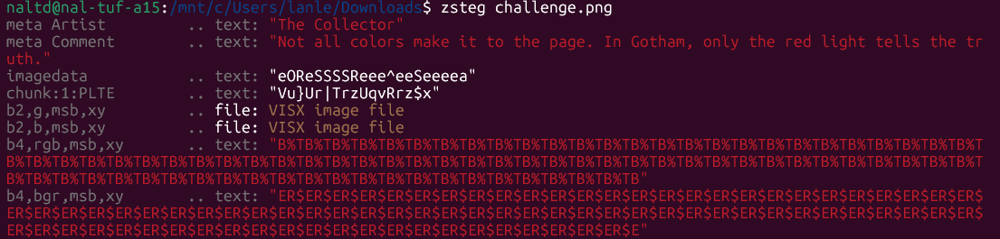

# ApoorvCTF - Forensics - The Gotham Files - 50 điểm
## Mô tả:
Tiếng Anh: A mysterious panel surfaced at this year's ComiCon. The artist left something behind.

Tiếng Việt: Một phần tranh bí ẩn xuất hiện tại ComiCon năm nay. Họa sĩ đã để lại thứ gì đó đằng sau.

[challenge.png](challenge.png)

## Thực hiện:
Việc đầu tiên tôi làm mỗi khi gặp dạng đề hình ảnh sẽ là chạy zsteg, và lần này nó không phụ lòng khi cho ra 1 đoạn "comment":



Tạm dịch: Không phải màu nào cũng vào được trang. Tại Gotham, chỉ có ánh đèn màu đỏ nói lên sự thật.

Dựa vào thông tin này, tôi đã sử dụng 1 chương trình được viết bằng Python để xuất ra những giá trị byte đỏ từ file ảnh:

```py
import PIL.Image

img = PIL.Image.open('challenge.png')
# Get the palette (it's a list of [R, G, B, R, G, B...])
palette = img.getpalette()

# Extract only the Red bytes (every 3rd byte starting at 0)
red_bytes = palette[0::3]

# Filter out the 0s and turn into a string
truth = "".join([chr(b) for b in red_bytes if b != 0])
print(f"Raw Red Truth: {truth}")
```

Sau khi chạy thì đây là đầu ra:
```
Raw Red Truth: üùõõòòòîòîèäáÊÎÊȜ’˜|À¼§‰dVUTUR$¬© ’ˆ‡ˆ††{y|€€€€w~^c`eF.KK%$% "ÅÆÁÃÂƝ¯qebzjgaoelUF\MNAW\M[QYWVCHTF6:<:99:7))));=9:453(••”•šŽzŽ†H=99665E7DC0/''-#+ %'#%%





apoorvctf{th3_c0m1cs_l13_1n_th3_PLTE}ç½fy4Ð    SÄð
v™#0¦*
```

Ngay trong output này đã cho ra cờ: `apoorvctf{th3_c0m1cs_l13_1n_th3_PLTE}`.

Và đây cũng là đáp án của thử thách này.