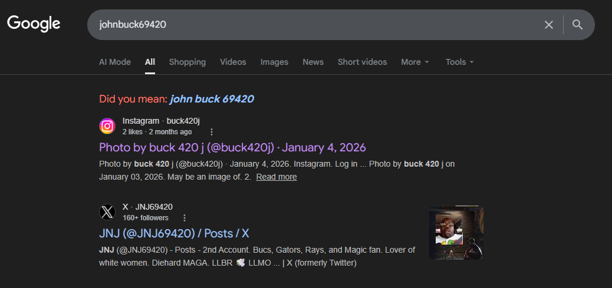
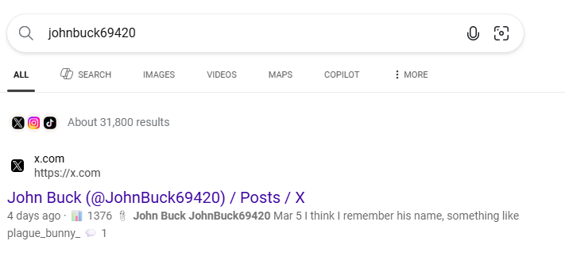
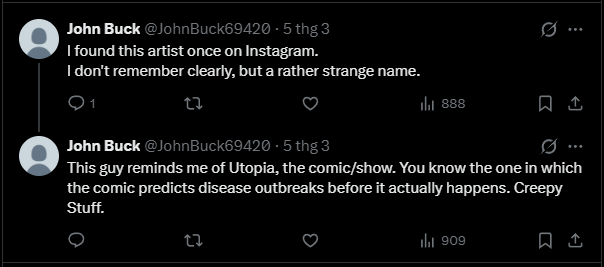
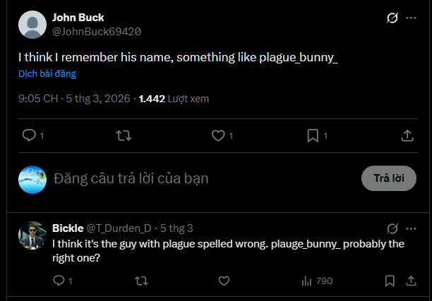
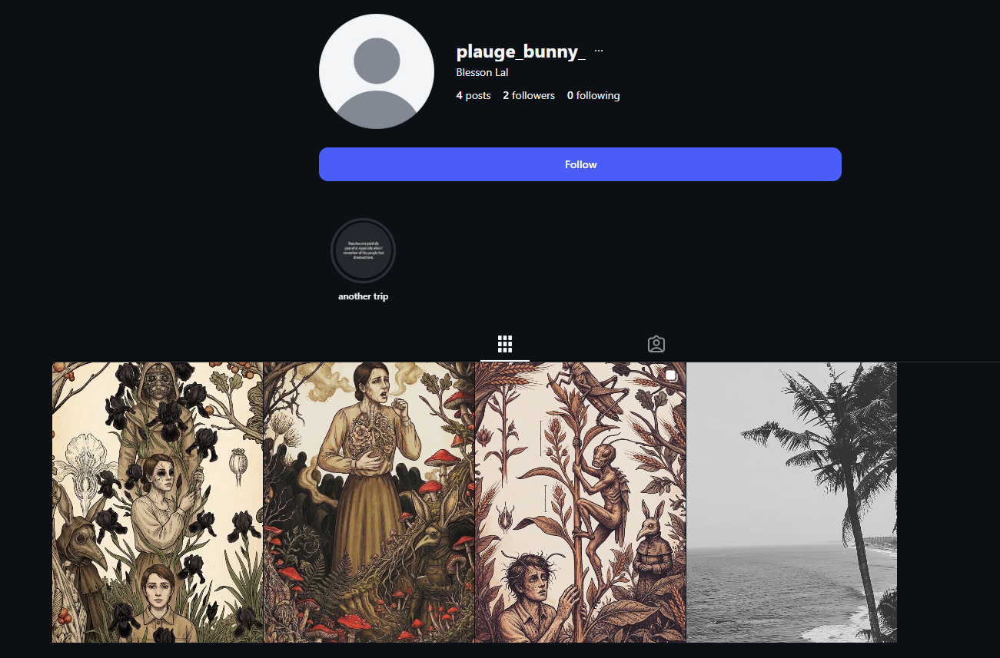
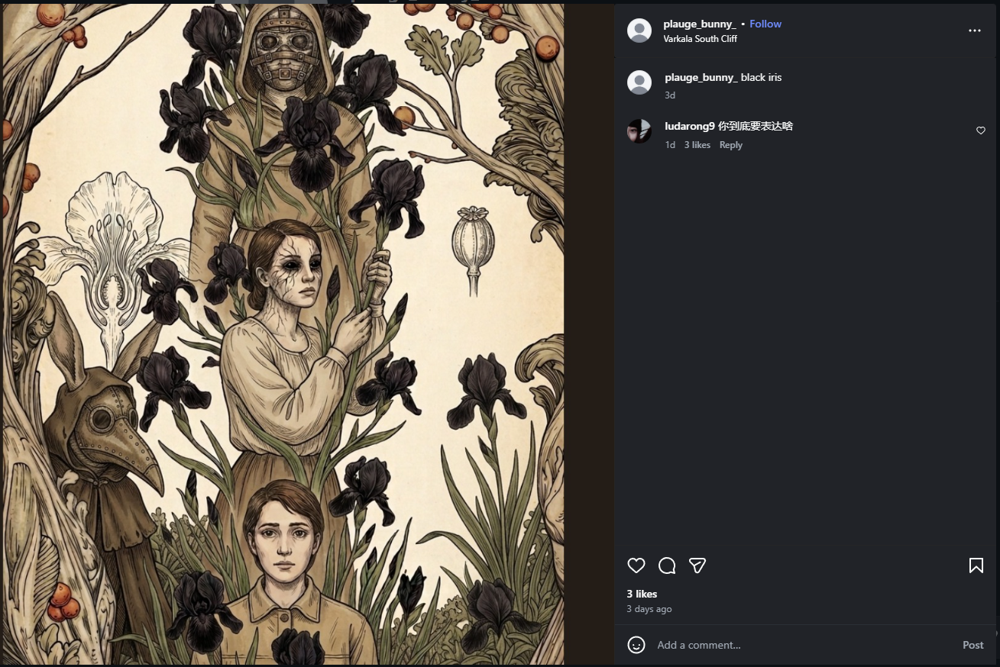
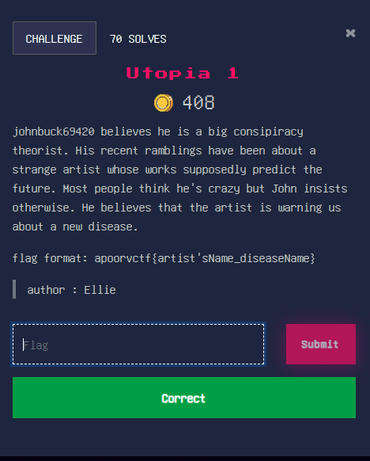

# ApoorvCTF - OSINT - Utopia 1 - 50 điểm
## Mô tả:
Tiếng Anh: johnbuck69420 believes he is a big consipiracy theorist. His recent ramblings have been about a strange artist whose works supposedly predict the future. Most people think he's crazy but John insists otherwise. He believes that the artist is warning us about a new disease.
flag format: apoorvctf{artist'sName_diseaseName}

Tiếng Việt: johnbuck69420 tin rằng anh ta là 1 người theo thuyết âm mưu lớn. Gần đây anh ấy có những suy nghĩ lan man về 1 họa sĩ kì lạ mà những tác phẩm của người đó có vẻ dự đoán trước được tương lai. Nhiều người nghĩ anh ta điên rồ nhưng John không nghĩ vậy. Anh ta tin rằng người họa sĩ đó đang cảnh báo chúng ta về 1 đại dịch mới.
định dạng cờ: apoorvctf{TênHọaSĩ_TênDịchBệnh}

## Thực hiện:
Dựa vào thông tin đã cho thì đầu tiên tôi đã lên Google tìm johnbuck69420, tuy nhiên thì không ra kết quả.

Vậy nên tôi chuyển sang 1 trang tìm kiếm khác là Bing, và lần này thì nó đã cho ra kết quả là 1 trang Twitter/X có cùng tên người dùng [JohnBuck69420](https://x.com/JohnBuck69420):

Truy cập vào trang của JohnBuck69420 thì có vẻ như các bài đăng của tài khoản này trùng khớp với mô tả của yêu cầu. Và trong đó có 2 bài đăng làm tôi chú ý.

Dựa vào thông tin này, khả năng đây là 1 họa sĩ trên Instagram, và tên tài khoản của họa sĩ này là "plauge_bunny_".

Sau đó tôi lên Instagram và tra tài khoản này, và nó có tồn tại 1 tài khoản là "plauge_bunny_" cùng những bức hình trùng khớp với các chi tiết mà John Buck đã viết trong các bài đăng của tài khoản đấy

Từ tài khoản này, tôi đã xác định được tên của họa sĩ này là Blesson Lal. Việc còn lại là tìm ra cái dịch bệnh mà người này dự đoán.

Nhấn vào hình ảnh mới nhất, tôi tìm được trong phần bình luận có 1 bình luận của tác giả là "black iris". Nên là tôi nghĩ rằng khả năng cao đây chính là tên của dịch bệnh mà John đã nghĩ tới.

Dựa vào các nội dung này, tôi rút ra được 1 flag là: `apoorvctf{BlessonLal_blackiris}`

Và đây chính là lá cờ của Utopia 1.