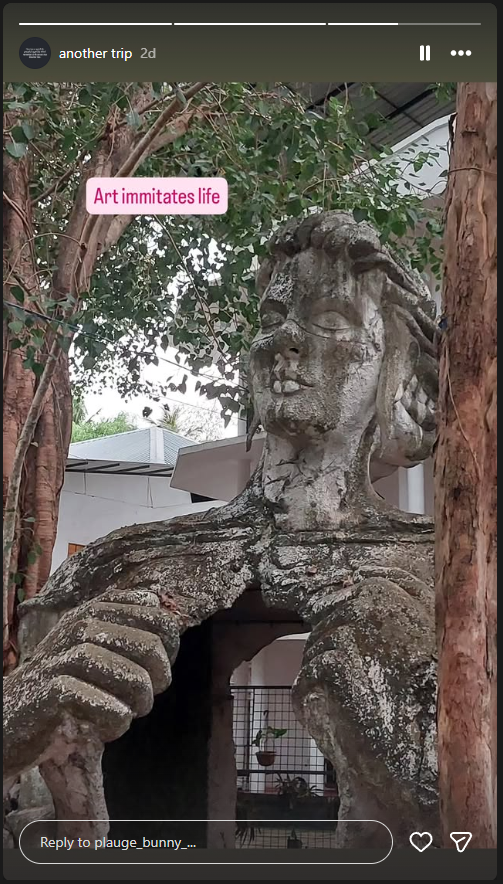
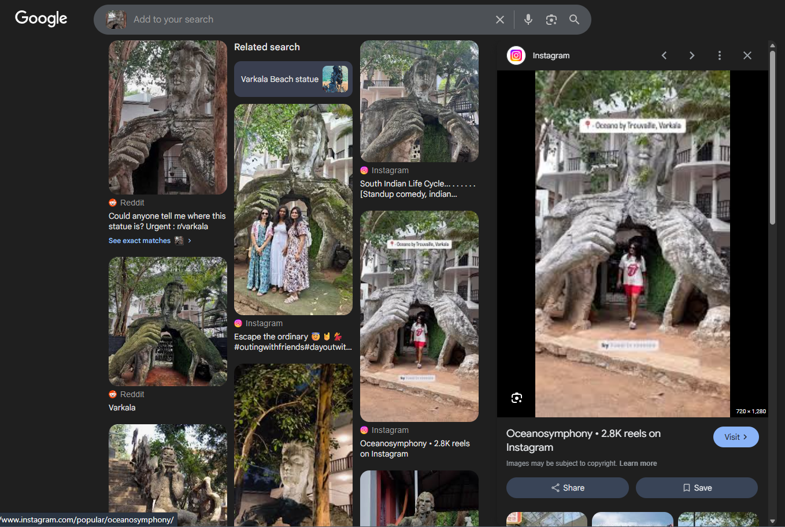
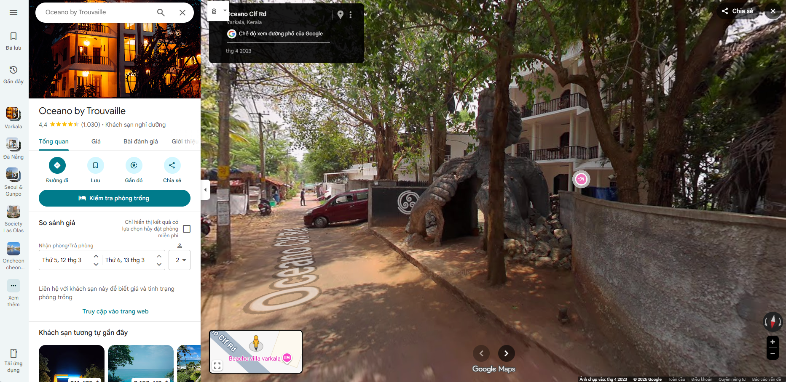

# ApoorvCTF - OSINT - Utopia 2 - 152 điểm
## Mô tả:
Tiếng Anh: John had been chasing the same lead for days, the artist. His last post was eerie and something new. The artist shares one last image of a statue, strange, bearing a resemblence to his style of art. Help john figure out where this was taken.

flag format: apoorvctf{latitude_longitude} **Note:** latitude and longitude should be upto **3 decimals**

Tiếng Việt: John đã cố gắng theo đuổi cùng một manh mối là người họa sĩ đó đã nhiều ngày. Bài đăng cuối cùng của anh ấy khá rùng rợn và là 1 thứ gì đó mới lạ. Họa sĩ đó đã chia sẻ bức ảnh cuối là 1 bức tượng, kỳ lạ, và có sự tương đồng với phong cách nghệ thuật của anh ấy. Hãy giúp John tìm được bức hình này đã được chụp ở đâu.

Định dạng cờ: apoorvctf{KinhTuyến_VĩTuyến} **Chú thích:** Kinh độ và vĩ độ phải được làm tròn tới **3 số sau dấu chấm**.

## Thực hiện:
Quay lại với tài khoản plauge_bunny_, ngoài các bài đăng trên tường ra thì tài khoản này còn có 1 mục là another trip. Khi bấm vào để kiểm tra thì trong story cuối cùng xuất hiện 1 bức tượng người phụ nữ với lồng ngực mở toang ra. Đây có vẻ chính là bức ảnh mà John đã nhắc đến.

Lúc này tôi sử dụng Google Lens để tìm kiếm thông tin về bức ảnh này, và có 1 kết quả mà có vẻ khả thi nhất, và cũng trùng với bức hình từ plauge_bunny_:

Dựa vào bức hình này, thì địa danh này có tên là "Oceano by Trouvaille", tọa lạc tại Ấn Độ.
Tìm kiếm vị trí này trên Google Maps, và vào Street View, có thể xác nhận đây là vị trí của bức ảnh trên.

Từ đó có thể xác định được tọa độ khi đã làm tròn là "8.726, 76.711".

Và khi đó cờ sẽ là: `apoorvctf{8.726_76.711}`